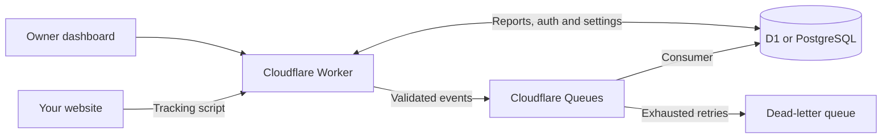

<p align="center">
  <picture>
    <source media="(prefers-color-scheme: dark)" srcset="apps/web/public/brand/logo-dark.svg">
    
  </picture>
</p>

<h1 align="center">Yet another analytics platform</h1>

<p align="center">
  Website analytics, visitor journeys and conversions — hosted in your own Cloudflare account.
</p>

<p align="center">
  <a href="#get-started">Get started</a> ·
  <a href="docs/README.md">Documentation</a> ·
  <a href="docs/DEPLOYMENT.md">Deploy</a> ·
  <a href="docs/ROADMAP.md">Roadmap</a>
</p>

---

Yaap brings traffic, custom events, funnels and payment reports into one private workspace. Run one Cloudflare Worker with **D1 or PostgreSQL**, add your websites, and install a small tracking script.

**Status:** active development. Local D1, PostgreSQL and Hyperdrive-emulation flows are tested. Live installation verification and several public-release requirements are still pending; see [release readiness](docs/ROADMAP.md#before-public-release). Source-available under [Elastic License 2.0](LICENSE.md).

## What’s built

| Capability | Included |
| --- | --- |
| **Traffic & audiences** | Pageviews, sources, campaigns, geography, devices, new/returning visitors and session metrics |
| **Reports & comparisons** | UTC date ranges, combined filters, previous periods and daily charts |
| **Events & properties** | Custom events with text, number and boolean properties; typed filtering and paginated exploration |
| **Goals & funnels** | Page-path and event goals, property conditions, ordered funnels, and conversion rates by source and landing page |
| **Visitor journeys** | Retained activity grouped by session, matching goals and linked payments |
| **Revenue** | Stripe webhooks and a server API, refunds, test/live modes, separate currencies and durable first-touch/last-non-direct attribution |
| **Live presence** | Current visitors and paths, kept separate from pageview counts |
| **Collection controls** | Full, anonymous or paused tracking; origin/path exclusions, bot filtering and retention policies |
| **Public API & MCP** | Scoped credentials, reporting and management tools, OpenAPI and OAuth client connections |
| **Private workspace** | One owner, multiple websites, light/dark themes and responsive reports |

## Get started

Use **Node.js 22.12+**. From a local checkout, the default D1 setup is:

```sh
npm ci
npm run db:setup:local
npm run db:migrate:local
npm run dev
```

Open **[localhost:8790/app](http://localhost:8790/app)**. On a fresh installation, enter `BOOTSTRAP_SECRET` from `apps/web/.dev.vars` and create the owner account. Then add a website using its exact origin and copy the snippet from **Settings → Installation**.

Already using local PostgreSQL? Run `npm run db:setup:postgres` before `npm run dev`. This creates and migrates `yaap_local` and selects it in `apps/web/.dev.vars`; it does not copy existing D1 data. [Database setup →](docs/DATABASES.md)

Want a populated workspace? After creating the owner, run `npm run db:seed` to add a new **Atlas Demo** site with synthetic traffic, goals, funnels and payments. Existing sites are preserved. [Development and demo options →](docs/DEVELOPMENT.md)

## Repository layout

This is an npm-workspaces monorepo with one root lockfile:

- `apps/web` — dashboard, Worker/API, database migrations and integration tests.
- `packages/client` — `@yaap/client`, the typed npm client and standalone tracking script.
- `docs` — shared product and development documentation.

Run app commands from the repository root as before. `npm run dev` and `npm run build` build the client automatically and serve it at the existing `/script.js` URL. See the [client guide](packages/client/README.md) for npm usage and local packaging; the package is not published yet.

## Track an event

After the tracking script loads, record meaningful actions with explicit properties:

```js
window.osAnalytics?.track("signup", {
  plan: "pro",
  seats: 3,
  trial: false,
});
```

Open **Events** to inspect it, or create a goal matching `signup` where `plan = "pro"`.

The standard snippet enables browser/session identifiers. Choose anonymous or paused collection in Installation to fit your site's tracking policy. Enabling tracking does not record consent. [Tracking modes and API →](docs/TRACKING.md)

## How it runs



**TanStack Start + React** render the dashboard. **Better Auth** protects the owner workspace. **Drizzle** defines both database schemas, with shared report calculations across providers. PostgreSQL uses **Hyperdrive** in production; assets, APIs, queue consumption and scheduled maintenance stay in the same Worker.

No payment provider, email service or R2 bucket is required for basic analytics.

## Deploy

[](https://deploy.workers.cloudflare.com/?url=https://github.com/dagurleo/yaap)

Deploy the complete repository with the root `wrangler.jsonc`. The button provisions D1 and two queues, asks for two owner secrets, builds both workspaces, applies migrations, and deploys the Worker. Basic analytics needs no email domain or billing provider. After deployment, open `/setup` with your bootstrap secret to create the owner.

The source repository must be public for other people to use the button. Local verification is covered by CI; a fresh-account live installation is still required before calling the flow verified.

[Cloudflare deployment guide →](docs/DEPLOYMENT.md) · [PostgreSQL through Hyperdrive →](docs/DATABASES.md#production-postgres-through-hyperdrive)

## Documentation

| Start here | Go deeper |
| --- | --- |
| [Tracking and identity](docs/TRACKING.md) | [Report and metric definitions](docs/REPORTING.md) |
| [Events and properties](docs/EVENTS.md) | [Goals and funnels](docs/CONVERSIONS.md) |
| [Website settings](docs/settings.md) | [Payments and attribution](docs/PAYMENTS.md) |
| [Local development](docs/DEVELOPMENT.md) | [Database architecture](docs/DATABASES.md) |
| [Deployment](docs/DEPLOYMENT.md) | [Operations](docs/OPERATIONS.md) · [Performance](docs/PERFORMANCE.md) |

## Development and next steps

```sh
npm run check              # Build, types, D1/tracker tests, deployment config
npm run test:postgres      # Requires local PostgreSQL; includes runtime checks
npm run test:hyperdrive    # Local Hyperdrive emulation with PostgreSQL
```

Tests use isolated fixtures. See [development](docs/DEVELOPMENT.md) for the project layout, schema workflow and UI conventions.

Next up: **installation verification and diagnostics**. Recovery, export/restore, capacity testing and live deployment verification remain release work. [Roadmap →](docs/ROADMAP.md)

## License

Yaap is source-available under [Elastic License 2.0 (ELv2)](LICENSE.md). It is free to self-host for personal and internal business use, including analytics for commercial websites. Infrastructure costs are your responsibility.

- You may use and modify Yaap for yourself or your company, subject to the license terms.
- Contractors may charge to install Yaap in a client's own Cloudflare account for that client's internal use, and provide updates and support, provided this does not amount to offering Yaap as a hosted or managed service.
- You may not provide Yaap to third parties as a hosted or managed service that gives them access to a substantial set of its features. This includes reselling access as your own analytics SaaS, whether billing is built into the app, handled elsewhere, or done manually. The restriction also applies to free hosted services.

This is a plain-language summary; the [full license](LICENSE.md) governs. ELv2 also requires preserving notices and includes restrictions on circumventing license-key functionality. See [Elastic's FAQ](https://www.elastic.co/licensing/elastic-license/faq) for examples. Third-party dependencies and bundled assets retain their respective licenses.
